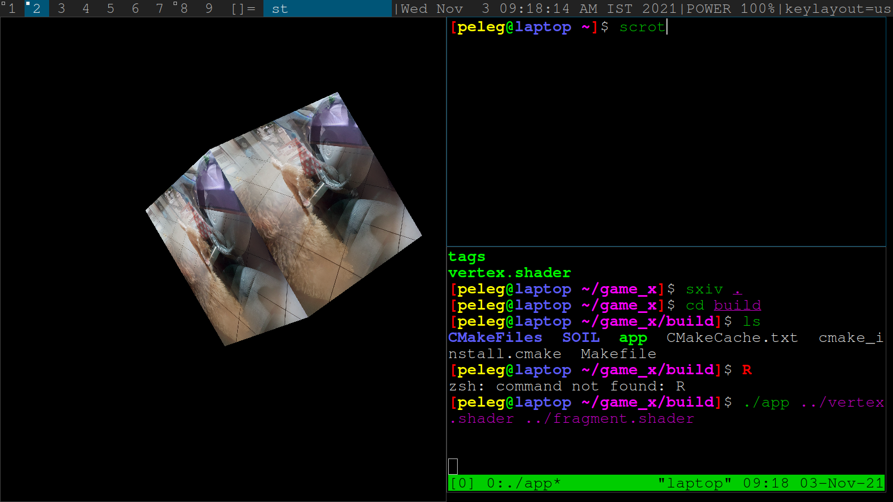

# State



Load OpenGL though glfw and use fragment/vertex shaders.

# Dependencies

* glfw - Handles opening a window and getting input, we will leave that for now
* glm - A math library for OpenGL. # TODO: get rid of it


# Mac Prerequisites
Install glew:
```
brew install glew
```

# Build and run (hopefully :))
```
mkdir build
cd build
# TODO: Find out setup for windows
cmake .. 
```

And to test that it works
```
cd build
./app ../vertex.shader ../fragment.shader
```
